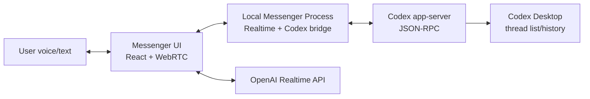

# Codex Messenger Design

## Goal

Build a local messenger-style app for talking to Codex through voice and text.
OpenAI Realtime API provides the low-latency voice interface, while Codex
app-server owns the actual Codex thread, turns, approvals, and desktop-visible
conversation history. The whole application is local-first: there is no hosted
Messenger backend to deploy or operate.

## Reference Repositories

This design follows the smallest useful patterns from these official OpenAI
Realtime examples:

- `openai/openai-realtime-console`: minimal Express + Vite + React app for
  Realtime API over WebRTC. It demonstrates a small backend that keeps the
  OpenAI API key server-side, exposes `/token` and `/session`, and shows client
  and server Realtime events in the UI.
- `openai/openai-realtime-agents`: Next.js + Agents SDK demo for voice agents.
  The key pattern for this project is the chat-supervisor architecture: a fast
  realtime agent keeps the voice conversation natural, while a stronger backend
  supervisor handles difficult work through a separate API boundary.
- `openai/openai-realtime-solar-system`: WebRTC + function calling demo. It
  shows a clean shape for defining Realtime tools as data, then mapping tool
  calls to local application actions.

We do not copy these apps wholesale. Messenger should borrow their boundaries:
session creation, WebRTC connection lifecycle, event logging, transcript
handling, and tool-call dispatch.

## Core Architecture



## Design Decisions

### Realtime is the voice layer, not the source of truth

Realtime should not independently answer substantive Codex questions. Its job is
to capture user speech, provide short conversational filler when useful, and
deliver Codex results back by voice. The Codex app-server remains the authority
for assistant work.

This mirrors the `openai-realtime-agents` chat-supervisor pattern: a realtime
agent handles immediacy, while a separate backend path handles complex work.
For Messenger, the "supervisor" is Codex app-server instead of the Responses API.

For the MVP, the UI should deterministically submit finalized user text to Codex.
Do not make a Realtime model tool call the only gate for deciding whether Codex
receives a user request. Realtime tool calls can be added later as convenience
commands, but the first implementation should keep the Codex submission path
explicit, idempotent, and debuggable.

### Codex app-server owns durable conversation state

The earlier verification showed that app-server-created threads appear in Codex
Desktop. Therefore the local Messenger process stores only the mapping needed to
resume:

```text
messengerConversationId -> codexThreadId
```

Codex itself stores the full thread transcript under its normal local state.
Messenger's local state should live in a user data directory and store only the
minimum mapping and display metadata:

```text
conversationId
codexThreadId
createdAt
updatedAt
lastKnownTitle
```

Realtime transcripts are UI/session artifacts unless explicitly promoted into a
Codex turn. Messenger should not maintain a second durable assistant transcript.

### Use WebRTC for browser audio

For the browser client, WebRTC is the default transport. The official examples
use a backend endpoint to create a Realtime session or exchange SDP while keeping
the standard OpenAI API key off the client. In Messenger, that endpoint must be
provided by a local process, not a hosted service.

For MVP, prefer the ephemeral-token shape:

```text
GET http://127.0.0.1:<port>/api/realtime/session -> OpenAI Realtime session/client secret
Browser connects to Realtime with WebRTC
```

The all-in-one SDP `/session` pattern from `openai-realtime-console` is useful
as a fallback or debug path, but the token-based flow gives the client a cleaner
connection lifecycle.

### Realtime tools become Messenger commands

The deterministic MVP path is:

```text
finalized user text -> POST /api/codex/message -> Codex app-server
```

After that works, define one narrow Realtime command tool:

```text
send_to_codex({ message: string })
```

When Realtime calls this tool, the UI forwards the message to the local Codex
bridge only if it passes the same validation and idempotency checks as the
deterministic text path. The bridge starts or resumes a Codex thread, sends a
turn, streams events back to the UI, and returns a concise final response for
voice playback.

Later tools can be added without changing the core architecture:

- `interrupt_codex`
- `resume_codex_thread`
- `archive_codex_thread`
- `open_thread_in_desktop`

## Components

### Frontend

Responsibilities:

- Connect and disconnect Realtime WebRTC sessions.
- Request microphone access and play model audio.
- Render a transcript of user speech, Realtime status, Codex events, and final
  Codex messages.
- Dispatch Realtime tool calls to the local Messenger process.
- Support push-to-talk and mute early; voice activity detection can come later.

Borrowed patterns:

- Event log panel from `openai-realtime-console`.
- Transcript update handling from `openai-realtime-agents`.
- Tool-call-to-app-action mapping from `openai-realtime-solar-system`.

### Local Messenger Process

Responsibilities:

- Hold `OPENAI_API_KEY`.
- Create Realtime sessions.
- Respect an optional `OPENAI_BASE_URL` for proxies or OpenAI-compatible API
  endpoints.
- Manage a Codex app-server subprocess or connect to a configured app-server
  endpoint.
- Translate app-server JSON-RPC events into UI events.
- Store conversation mappings.

This is a local-only process. It can be packaged inside a desktop app later, or
started as a local development process for the MVP. It should bind only to
loopback (`127.0.0.1`) when exposing HTTP or SSE endpoints.

Loopback binding is not enough as a browser security boundary. The local process
must also:

- Generate a per-launch capability token and require it on every state-changing
  API request.
- Validate `Origin`, `Host`, and fetch metadata headers where available.
- Use a random available port by default.
- Require `conversationId` and an idempotency key on Codex message submission.
- Expose only an allowlist of local operations to the UI.

Initial Codex operation allowlist:

- Start or resume a Codex thread.
- Start a Codex turn.
- Interrupt the active Codex turn.
- Read local conversation mappings.

MVP approvals are display-only. If Codex requires approval, Messenger should
show that state and direct the user to approve in Codex Desktop, or let the user
interrupt/cancel from Messenger. Messenger should not implement approval grants
until the trust boundary is designed separately.

Initial endpoints:

```text
GET  /api/realtime/session
POST /api/codex/message
POST /api/codex/interrupt
GET  /api/conversations
GET  /api/conversations/:id/events
```

### Codex Bridge

Responsibilities:

- Initialize app-server JSON-RPC once per process or per session.
- `thread/start` when no `codexThreadId` exists.
- `thread/resume` when continuing an existing conversation.
- Complete a minimal connect-time turn before showing a Codex Desktop deeplink,
  because a thread created without a turn may not have a Desktop rollout yet.
- `turn/start` for new user messages.
- Stream `item/*`, `turn/*`, `thread/status/changed`, and approval events to the
  UI.
- Produce a final short response for Realtime voice output.

The bridge should be interface-driven so tests can mock Codex without spawning
the real app-server.

For MVP event streaming, prefer Server-Sent Events from the local Messenger
process to the UI. Do not multiplex Codex app-server events through the Realtime
data channel at first; keeping Realtime audio events and Codex work events on
separate channels makes replay, logging, and failure handling simpler.

## MVP Flow

1. User opens Messenger.
2. UI calls `GET /api/realtime/session`.
3. UI establishes WebRTC with Realtime and opens the `oai-events` data channel.
4. User speaks or types a message.
5. UI receives finalized user text from typing or Realtime transcription.
6. The local Messenger process sends the message to Codex app-server.
7. UI displays Codex streaming events.
8. The local Messenger process returns the final Codex response.
9. UI sends or speaks the final response through the Realtime session.

## Non-Goals for MVP

- Multi-agent Realtime orchestration.
- Full Codex Desktop replacement.
- Remote Codex app-server exposure.
- Multi-user auth.
- Persistent cloud sync.
- Hosted backend operation.
- Editing or applying code changes from Messenger-specific UI controls.

## Open Questions

- Should Realtime call `send_to_codex` directly as a tool, or should the UI send
  every finalized transcript to Codex deterministically? MVP decision:
  deterministic transcript submission first; tool calls later.
- Should Codex event streaming use Server-Sent Events, WebSocket, or the same
  Realtime data channel? MVP decision: SSE from the local Messenger process.
- Should the first implementation be a browser UI plus local loopback process, or
  a desktop shell such as Tauri/Electron/SwiftUI that embeds the local process?
  The browser plus loopback process is the fastest MVP, while a desktop shell is
  the cleaner end-user shape.
- Should API keys initially come from `.env` only, or should the MVP include a
  local key setup flow? Future packaged builds should prefer the OS keychain.
